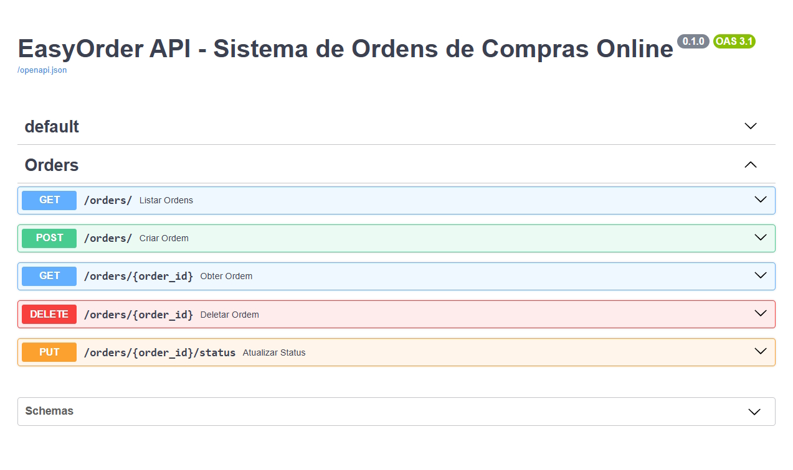

# 📦 EasyOrder


**EasyOrder** é um sistema de exemplo para gerenciamento de pedidos online, desenvolvido com **FastAPI** e estruturado para seguir boas práticas de DevOps, CI/CD e conteinerização com Docker.

---

## 📜 Sumário
- [Visão Geral](#-visão-geral)
- [Tecnologias Utilizadas](#-tecnologias-utilizadas)
- [Arquitetura](#-arquitetura)
- [Instalação e Execução](#-instalação-e-execução)
- [Testes](#-testes)
- [CI/CD](#-cicd)
- [Pre-commit](#-pre-commit)
- [Deploy](#-deploy)
- [Documentação](#-documentação)
- [Capturas de Tela](#-capturas-de-tela)
- [Contribuindo](#-contribuindo)
- [Licença](#-licença)

---

## 📖 Visão Geral
O **EasyOrder** foi criado como parte de um projeto de ensino para ilustrar:
- Uso de **FastAPI** para construção de APIs modernas e rápidas
- Estruturação limpa do código com separação de responsabilidades
- Práticas de **DevOps**, incluindo CI/CD no GitHub Actions
- Conteinerização com **Docker**
- Testes unitários e de integração com **pytest**
- Desenvolvimento em container utilizando **Dev Containers** do VSCode

---

## 🛠 Tecnologias Utilizadas
- **Linguagem**: Python 3.12
- **Framework**: FastAPI
- **Testes**: pytest
- **Containerização**: Docker
- **Dev Container**: VSCode + devcontainer.json
- **CI/CD**: GitHub Actions
- **Banco de Dados**: Em memória (para demonstração, via `memory_db.py`)


---

## 🏗 Arquitetura
```
EasyOrder/
│
├── src/
│ ├── main.py # Ponto de entrada da aplicação
│ ├── db/ # Banco de dados (simulado)
│ ├── models/ # Modelos de dados
│ └── routes/ # Rotas da API
│
├── docs/
│   └── screenshots/ # Prints de tela para documentação
│
├── tests/ # Testes unitários e de integração
├── Dockerfile # Configuração de imagem Docker
├── .github/workflows/ci.yml # Pipeline CI/CD
├── requirements.txt # Dependências do projeto
└── requirements-dev.txt # Dependências do projeto para desenvolvimento
```

---

## 🚀 Instalação e Execução

### 1️⃣ Pré-requisitos
- **Docker** instalado e rodando
- **Visual Studio Code** instalado
- Extensão **Dev Containers** instalada ([VSCode Dev Containers](https://marketplace.visualstudio.com/items?itemName=ms-vscode-remote.remote-containers))

### 2️⃣ Clonar o repositório
```bash
git clone https://github.com/guipatriota/EasyOrder.git
cd EasyOrder
```

### 3️⃣ Abrir no Dev Container
1. Abra o projeto no VSCode ou IDE compatível:
```bash
code .
```

2. Pressione `F1` → **Dev Containers: Reopen in Container**
O VSCode irá:
- Construir a imagem a partir do Dockerfile usando o target `dev`. Isto fará:
  - Montagem do workspace dentro do container
  - Instalação de todas as dependências definidas no `requirements.txt` e `requirements-dev.txt`
  - Inicializará o servidor com `uvicorn`

### 4️⃣ Executar a aplicação dentro do container
No terminal integrado do VSCode (já dentro do container):
Obs.: Este comando já deve rodar automaticamente. Faça-o apenas se o servidor da API não estiver funcionando.
```bash
uvicorn src.main:app --host 0.0.0.0 --port 8000 --reload
```
A API estará disponível em: `http://127.0.0.1:8000`
A documentação interativa do Swagger: `http://localhost:8000/docs`

---

## 🧪 Testes
```bash
pytest tests/ --maxfail=1 --disable-warnings -v
```
---

## ⚙️ CI/CD
Este projeto já possui pipeline configurado no **GitHub Actions**:
- **Lint**: Executa verificação de atendimento aos padrões de projeto
- **Build**: Executa testes automaticamente a cada push
- **Deploy**: Pode ser configurado para AWS, Heroku ou outros provedores

---

## 🔍 Pre-commit

O **pre-commit** é uma ferramenta que garante que o código siga padrões de qualidade **antes de ser commitado** no Git.  
Ele executa automaticamente uma série de verificações e formatações para manter o projeto consistente e evitar problemas no pipeline.

### 📌 Motivação
- Padronizar código (formatação, imports, estilo)
- Evitar commits com erros de lint ou testes quebrados
- Garantir que todos contribuidores sigam as mesmas regras
- Reduzir falhas no CI/CD

### 📥 Instalação inicial
1. Instale o pre-commit:
```
pip install pre-commit
```

2. Instale os hooks configurados:
```
pre-commit install --hook-type pre-commit --hook-type pre-push
```

3. Para rodar manualmente em todos os arquivos:
```
pre-commit run --all-files
```

### ⚙️ Hooks configurados neste projeto
- **Black** → Formata o código automaticamente.
- **isort** → Organiza imports de forma consistente com o Black.
- **Flake8** (+ plugins) → Detecta problemas de estilo, nomes e boas práticas.
- **check-docstrings-length** → Verifica tamanho de docstrings (script local).
- **pytest com cobertura** (pre-push) → Executa testes e falha se a cobertura for menor que 75%.

⚠️ Se um hook modificar arquivos, o commit será interrompido. Você precisará revisar as alterações, adicioná-las novamente com `git add` e repetir o commit.

---

## 🌐 Deploy
**Link de Deploy**: [https://easyorder.example.com](https://easyorder.example.com)
---

## 📖 Documentação
**Link da Doc**: [https://guipatriota.github.io/EasyOrder/](https://guipatriota.github.io/EasyOrder/)
1. Para abrir servidor da documentação:
```
python -m http.server 8001 --directory docs/_build/html
```

2. Para compilar documentação atualizada:
```
pip install -r docs/requirements-docs.txt
pip install -e .
python -m sphinx.ext.apidoc -f -o docs/api src
sphinx-build -b html docs docs/_build/html 
```
---

## 🖼 Captura de Tela

  

---

## 🤝 Contribuindo
Contribuições são bem-vindas!  
Para contribuir:
1. Faça um fork do projeto
2. Crie uma branch (`git checkout -b feature/nova-funcionalidade`)
3. Commit suas alterações (`git commit -m 'Adiciona nova funcionalidade'`)
4. Envie um push para a branch (`git push origin feature/nova-funcionalidade`)
5. Abra um Pull Request

---

## 📄 Licença
Este projeto está licenciado sob a [MIT License](LICENSE).

